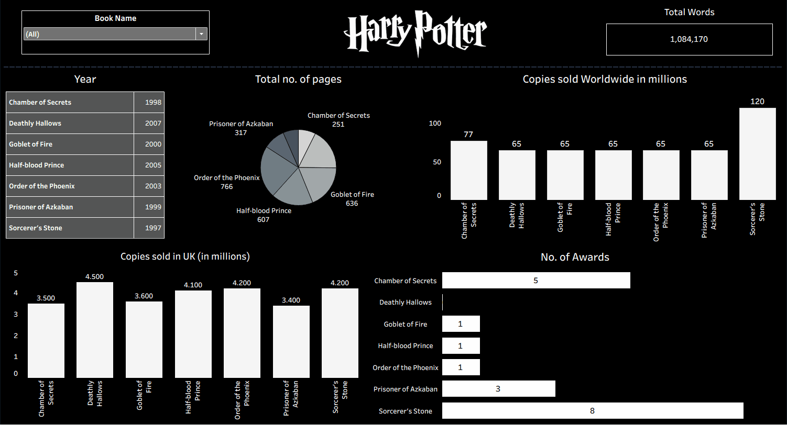

<div align="center">
  <h1>🔮 The Wizarding World Unveiled: A Harry Potter Data Journey</h1>
  <p>
    <strong>Wizarding Analytics</strong><br>
    Explore J.K. Rowling’s magical universe through data — book sales, word counts, character mentions, and more.
  </p>
  <p>
    <a href="https://public.tableau.com/app/profile/dinesh.barri8170/viz/TheWizardingWorldUnveiledAHarryPotterDataJourney/Dashboard1" target="_blank">
      🚀 View Live Tableau Dashboard
    </a>
  </p>
  
</div>

---

## ✨ Project Overview

Welcome to **Wizarding Analytics** — a data-driven exploration of the Harry Potter universe.  
This project weaves together multiple public datasets (book metadata, character stats, full text corpora) to create immersive visual stories about J.K. Rowling’s saga.  
From comparing book popularity and awards to mapping character appearances and sentiment trends — this is Harry Potter reimagined through analytics.

---

*** Project Structure

```
HarryPotter-Data-Analytics/
  |
  ├── README.me   
  │   ├── harry_potter_data_data.csv
  │   
  ├── tableau/
  │   └── WizardingAnalytics.twbx   (your packaged workbook)
  ├── images/
  │   └── preview.gif / dashboard_screens.png
  └── LICENSE
```

---

## 🧱 Key Themes & Dashboards

Here’s what you’ll find in the Tableau workbook:

| Theme | Description |
|---|---|
| **Book Metrics** | Compare book sales, pages, awards, release year side by side. |
| **Character Analytics** | Show top characters by count, book-wise appearance, and co-occurrence networks. |
| **Text & Sentiment** | Word count per book, sentiment score trends across chapters. |
| **Interactive Storytelling** | Filters by book, character, and year to drive custom insights. |

Each dashboard panel is designed for clarity, narrative progression, and visual cohesion — dark theme with rich colors to match the magical theme.

---
## 📦 Data 


---

## 🚀 How to Explore

1. **Open the Tableau Public link** above to view the live dashboard.  
2. Download the `.twbx` workbook from this repo (in `tableau/` folder) to open locally in Tableau Desktop / Tableau Public.  
3. You can replace or update the data CSVs in `data/` and refresh the workbook to see new visuals.  
4. Experiment: add new datasets (fanfiction, film data) or new sheets (e.g. house themes, quotes).

---

## 🧠 Insights & Findings

Here are some highlights I discovered:

- *“Harry Potter and the Deathly Hallows”* leads both in page count and sales among the 7.  
- The later books tend to have more negative sentiment overall (more conflict, darker tone).  
- Some supporting characters spike in mentions unexpectedly in specific books (e.g. **Dumbledore**, **Snape**).  
- Awards do not always correlate with highest sales or pages — interesting discrepancies emerge.

These patterns reveal the tension between narrative, popularity, and reception in the wizarding world.

---

## 📚 How You Can Extend This

- Add **house-level** analytics: affiliation, mention count per house.  
- Integrate **movie box office / ratings** data to compare book vs film popularity.  
- Visualize **character networks**: co-occurrence graphs, centrality metrics.  
- Use **natural language processing**: topic modeling, sentiment timeline per chapter.

---

## 🧑‍💻 About & License

**Author:** Your Name / GitHub (e.g. Dinu)  
**Contact:** [dineshbarri1997@gmail.com] / [https://www.linkedin.com/in/dinesh-barri/]  

**License:** MIT (or whatever open license you prefer)  

---

> “Words are, in my not-so-humble opinion, our most inexhaustible source of magic.” — *Albus Dumbledore*

---

Let me know when you have added your Tableau workbook and images, and I can generate a **preview GIF** from it or help you integrate it with GitHub Pages so your repo looks polished and clickable.
::contentReference[oaicite:8]{index=8}
